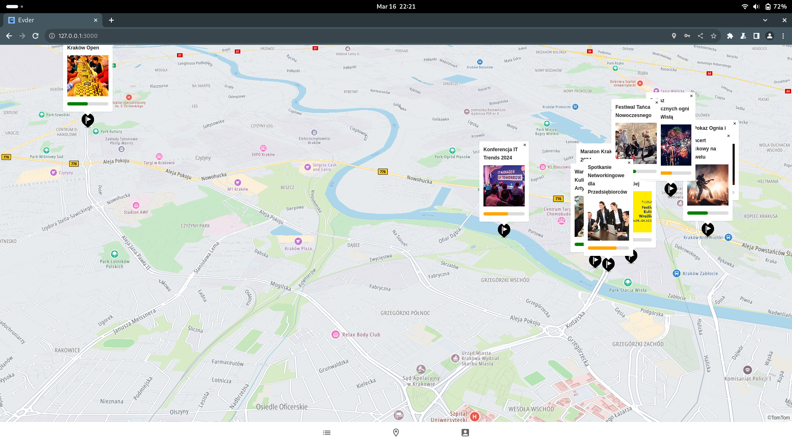

  

Evder is an innovative React application developed during the Software Mansion Hackathon 2024. The challenge was to create a solution that enhances life in Kraków. Evder addresses the issue of event discovery, helping residents and visitors stay informed about activities happening around them.

## Features
- **User Accounts** – Register and manage your profile seamlessly.
- **Event Creation** – Organize events with precise map localization.
- **Event Participation** – Join events and connect with others.
- **Interactive Map** – Powered by TomTom SDK for intuitive navigation.

## Tech Stack
- **Frontend**: React, Vite  
- **Backend**: Django
- **Maps**: TomTom SDK  

Evder is designed to bridge the gap between event organizers and attendees, making it easier to engage with Kraków’s vibrant community.

---

